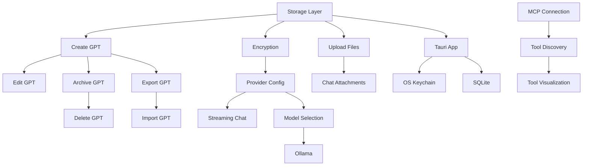

# Features List: Local-First GPT Creation Platform

<!-- prettier-ignore-start -->

**Document Version:** 1.0  
**Created:** December 20, 2025  
**Source:** PRD v2.0  
**Status:** Ready for Implementation Planning

<!-- prettier-ignore-end -->

---

## Product Overview

The Local-First GPT Creation Platform is a privacy-focused application enabling technical users to create, customize, and use AI assistants (GPTs) with complete data sovereignty. Key differentiators:

- **Local-First Architecture**: All data stored locally in IndexedDB with optional sync
- **Multi-Provider Support**: OpenAI, Anthropic, Azure, and Ollama (local models)
- **Knowledge Base Integration**: Files, URLs, and text snippets for context
- **Tool Integration**: MCP protocol for extensible tool capabilities
- **Data Portability**: Full export/import with OpenAI-compatible formats

**Target Users**: Privacy-conscious researchers, indie developers, AI hobbyists

---

## Table of Contents

- [Summary Dashboard](#summary-dashboard)
- [Category 1: GPT Configuration Management](#category-1-gpt-configuration-management)
- [Category 2: Knowledge Base Management](#category-2-knowledge-base-management)
- [Category 3: Tool Integration (MCP)](#category-3-tool-integration-mcp)
- [Category 4: Chat Interface](#category-4-chat-interface)
- [Category 5: Multi-Model Support](#category-5-multi-model-support)
- [Category 6: Data Portability](#category-6-data-portability)
- [Category 7: Security & Encryption](#category-7-security--encryption)
- [Category 8: Performance & Reliability](#category-8-performance--reliability)
- [Category 9: Accessibility](#category-9-accessibility)
- [Category 10: Desktop Application](#category-10-desktop-application)
- [Category 11: Sync & Collaboration](#category-11-sync--collaboration)
- [Feature Dependencies](#feature-dependencies)
- [Implementation Phases](#implementation-phases)

---

## Summary Dashboard

### Feature Counts by Priority

| Priority        | Count | Percentage |
| --------------- | ----- | ---------- |
| **MUST HAVE**   | 27    | 47%        |
| **SHOULD HAVE** | 19    | 33%        |
| **COULD HAVE**  | 11    | 19%        |
| **WON'T HAVE**  | 0     | 0%         |
| **Total**       | 57    | 100%       |

### Feature Counts by Category

| Category            | Must | Should | Could | Total |
| ------------------- | ---- | ------ | ----- | ----- |
| GPT Configuration   | 4    | 2      | 1     | 7     |
| Knowledge Base      | 2    | 1      | 1     | 4     |
| Tool Integration    | 0    | 3      | 3     | 6     |
| Chat Interface      | 3    | 3      | 1     | 7     |
| Multi-Model Support | 3    | 1      | 0     | 4     |
| Data Portability    | 2    | 1      | 1     | 4     |
| Security            | 5    | 1      | 0     | 6     |
| Performance         | 3    | 3      | 0     | 6     |
| Accessibility       | 5    | 1      | 0     | 6     |
| Desktop App         | 0    | 0      | 4     | 4     |
| Sync                | 0    | 3      | 0     | 3     |

### Complexity Distribution

| Complexity | Count | Percentage |
| ---------- | ----- | ---------- |
| Low        | 18    | 32%        |
| Medium     | 25    | 44%        |
| High       | 14    | 25%        |

---

## Category 1: GPT Configuration Management

### F-101: Create GPT Configuration

| Attribute        | Value                 |
| ---------------- | --------------------- |
| **Priority**     | MUST HAVE             |
| **Complexity**   | Medium                |
| **Phase**        | 1                     |
| **Personas**     | Maya, Tomas, Lei      |
| **Dependencies** | F-701 (Storage Layer) |

**Description**: Users can create new GPT configurations with custom personas, system prompts, and model settings.

**Acceptance Criteria**:

```gherkin
Given a user is on the GPT library page
When they click "Create New GPT"
Then they see a configuration form with:
  - Name field (required, 1-100 characters)
  - Description field (optional, 0-500 characters)
  - System prompt editor (required, supports markdown)
  - Model selector (defaults to user's preferred provider)

Given a user has filled required fields
When they click "Save"
Then the GPT is persisted to IndexedDB
And appears in the GPT library immediately
And a success notification is displayed
```

**Technical Considerations**:

- Zod schema validation on form submit
- UUID generation for GPT ID
- Optimistic UI update before persistence confirmation

**Edge Cases**:

- Duplicate GPT names (allowed, warn user)
- Browser storage quota exceeded (show clear error with suggestions)

---

### F-102: Edit GPT Configuration

| Attribute        | Value            |
| ---------------- | ---------------- |
| **Priority**     | MUST HAVE        |
| **Complexity**   | Medium           |
| **Phase**        | 1                |
| **Personas**     | Maya, Tomas, Lei |
| **Dependencies** | F-101            |

**Description**: Users can modify existing GPT configurations with auto-save and version history.

**Acceptance Criteria**:

```gherkin
Given a user has an existing GPT
When they open it for editing
Then all current values are pre-populated
And changes are auto-saved after 2 seconds of inactivity
And a version history entry is created on explicit save

Given a user is editing a GPT
When another browser tab has the same GPT open
Then changes are synchronized within 500ms (same device)
```

**Technical Considerations**:

- Debounced auto-save (2s delay)
- BroadcastChannel API for cross-tab sync
- Version incrementing on explicit save

**Edge Cases**:

- Conflicting edits in multiple tabs (last-write-wins with notification)
- Network interruption during save (queue for retry)

---

### F-103: Duplicate GPT

| Attribute        | Value        |
| ---------------- | ------------ |
| **Priority**     | SHOULD HAVE  |
| **Complexity**   | Low          |
| **Phase**        | 2            |
| **Personas**     | Lei, Tomas   |
| **Dependencies** | F-101, F-102 |

**Description**: Users can create copies of existing GPTs as starting points for new configurations.

**Acceptance Criteria**:

```gherkin
Given a user has an existing GPT
When they select "Duplicate"
Then a new GPT is created with:
  - Name: "{original name} (Copy)"
  - All settings copied except id and timestamps
  - Knowledge base references copied (not files)
And the user is navigated to edit the duplicate
```

**Technical Considerations**:

- Deep clone of configuration object
- Knowledge file references only (not blob duplication)
- New UUID and timestamps

---

### F-104: Organize GPTs with Folders/Tags

| Attribute        | Value       |
| ---------------- | ----------- |
| **Priority**     | SHOULD HAVE |
| **Complexity**   | Medium      |
| **Phase**        | 2           |
| **Personas**     | Maya, Lei   |
| **Dependencies** | F-101       |

**Description**: Users can organize GPTs into folders and apply tags for filtering.

**Acceptance Criteria**:

```gherkin
Given a user has multiple GPTs
When they create a folder/collection
Then they can drag GPTs into the folder
And folders can be nested up to 3 levels
And folder state persists across sessions

Given a user has tagged GPTs
When they filter by tag
Then only matching GPTs are displayed
And filter state is preserved in URL for sharing
```

**Technical Considerations**:

- Drag-and-drop library (dnd-kit or similar)
- URL query params for filter state
- IndexedDB indexing on tags array

**Edge Cases**:

- Deeply nested folders (limit to 3 levels)
- Tag name conflicts (case-insensitive matching)

---

### F-105: Archive GPT

| Attribute        | Value            |
| ---------------- | ---------------- |
| **Priority**     | MUST HAVE        |
| **Complexity**   | Low              |
| **Phase**        | 1                |
| **Personas**     | Maya, Tomas, Lei |
| **Dependencies** | F-101            |

**Description**: Users can archive GPTs to hide them from default view while preserving data.

**Acceptance Criteria**:

```gherkin
Given a user wants to remove a GPT
When they select "Archive"
Then the GPT is hidden from default view
And can be restored from "Archived" filter
And associated conversations are preserved
```

**Technical Considerations**:

- Boolean `isArchived` flag on GPT record
- Default filter excludes archived
- Archived view in sidebar/dropdown

---

### F-106: Delete GPT Permanently

| Attribute        | Value            |
| ---------------- | ---------------- |
| **Priority**     | MUST HAVE        |
| **Complexity**   | Low              |
| **Phase**        | 1                |
| **Personas**     | Maya, Tomas, Lei |
| **Dependencies** | F-105            |

**Description**: Users can permanently delete archived GPTs with associated data.

**Acceptance Criteria**:

```gherkin
Given a user wants to permanently delete
When they select "Delete" on an archived GPT
Then a confirmation dialog appears with conversation count
And deletion is irreversible
And associated conversations are deleted
```

**Technical Considerations**:

- Cascade delete: GPT → Conversations → Messages
- Knowledge file cleanup if orphaned
- Confirmation modal with count

**Edge Cases**:

- Large conversation history (batch delete for performance)

---

### F-107: GPT Version History

| Attribute        | Value      |
| ---------------- | ---------- |
| **Priority**     | COULD HAVE |
| **Complexity**   | Medium     |
| **Phase**        | 3          |
| **Personas**     | Tomas      |
| **Dependencies** | F-102      |

**Description**: Users can view and restore previous versions of GPT configurations.

**Acceptance Criteria**:

```gherkin
Given a user has made multiple explicit saves to a GPT
When they view version history
Then they see a list of versions with timestamps
And can preview differences between versions
And can restore any previous version

Given storage constraints
When version count exceeds 20
Then oldest versions are automatically pruned
```

**Technical Considerations**:

- Separate versions table in IndexedDB
- Diff visualization for comparison
- Storage budget per GPT for versions

---

## Category 2: Knowledge Base Management

### F-201: Upload Knowledge Files

| Attribute        | Value                 |
| ---------------- | --------------------- |
| **Priority**     | MUST HAVE             |
| **Complexity**   | High                  |
| **Phase**        | 2                     |
| **Personas**     | Maya, Tomas           |
| **Dependencies** | F-701 (Storage Layer) |

**Description**: Users can upload documents to include in GPT context.

**Acceptance Criteria**:

```gherkin
Given a user is configuring GPT knowledge
When they upload a file
Then the following formats are accepted:
  | Format | Max Size | Processing        |
  | PDF    | 20MB     | Text extraction   |
  | DOCX   | 10MB     | Text extraction   |
  | TXT    | 5MB      | Direct use        |
  | MD     | 5MB      | Direct use        |
  | JSON   | 5MB      | Formatted display |
And files are stored in IndexedDB as blobs
And progress indicator shows upload status
And error messages are specific (format, size, corruption)

Given a file exceeds browser storage quota
When upload is attempted
Then user sees clear message with:
  - Current storage usage
  - File size
  - Suggestion to use desktop app or remove other files
```

**Technical Considerations**:

- PDF.js for PDF text extraction
- Mammoth.js for DOCX parsing
- Chunking for large files (context window limits)
- Storage quota detection via `navigator.storage.estimate()`

**Edge Cases**:

- Encrypted PDFs (reject with clear error)
- Scanned PDFs without OCR (warn about limited content)
- Very large files (suggest desktop app)

---

### F-202: URL References

| Attribute        | Value       |
| ---------------- | ----------- |
| **Priority**     | SHOULD HAVE |
| **Complexity**   | Medium      |
| **Phase**        | 2           |
| **Personas**     | Maya, Lei   |
| **Dependencies** | F-201       |

**Description**: Users can add web URLs as knowledge sources with optional caching.

**Acceptance Criteria**:

```gherkin
Given a user adds a URL reference
When the URL is valid and accessible
Then metadata is fetched (title, description, favicon)
And content is optionally cached locally
And last-fetched timestamp is displayed

Given a URL becomes inaccessible
When the GPT is used in chat
Then cached content is used if available
And a warning indicator shows stale status
```

**Technical Considerations**:

- CORS limitations (proxy or extension for some sites)
- HTML-to-text extraction
- Cache invalidation strategy

**Edge Cases**:

- CORS-blocked URLs (show error, suggest alternatives)
- Dynamic/JS-rendered content (may not extract properly)

---

### F-203: Text Snippets

| Attribute        | Value            |
| ---------------- | ---------------- |
| **Priority**     | MUST HAVE        |
| **Complexity**   | Low              |
| **Phase**        | 2                |
| **Personas**     | Maya, Tomas, Lei |
| **Dependencies** | F-701            |

**Description**: Users can create and edit inline text snippets for GPT context.

**Acceptance Criteria**:

```gherkin
Given a user creates a text snippet
When they provide name and content
Then the snippet is saved with character count
And can be edited inline
And supports markdown formatting
And maximum size is 100KB per snippet
```

**Technical Considerations**:

- Markdown editor component
- Character/token count display
- Inline editing without modal

---

### F-204: Knowledge Base Organization

| Attribute        | Value               |
| ---------------- | ------------------- |
| **Priority**     | COULD HAVE          |
| **Complexity**   | Low                 |
| **Phase**        | 3                   |
| **Personas**     | Maya                |
| **Dependencies** | F-201, F-202, F-203 |

**Description**: Users can organize knowledge items with categories and tags.

**Acceptance Criteria**:

```gherkin
Given a user has multiple knowledge items
When they assign categories or tags
Then items can be filtered by category/tag
And categories persist across GPTs (shared library)
```

---

## Category 3: Tool Integration (MCP)

### F-301: MCP Server Connection

| Attribute        | Value              |
| ---------------- | ------------------ |
| **Priority**     | SHOULD HAVE        |
| **Complexity**   | High               |
| **Phase**        | 2                  |
| **Personas**     | Tomas              |
| **Dependencies** | F-702 (Encryption) |

**Description**: Users can connect to MCP servers for tool discovery and execution.

**Acceptance Criteria**:

```gherkin
Given a user configures an MCP server
When they provide server URL (SSE endpoint)
Then connection is tested automatically
And available tools are discovered and listed
And tool schemas are validated against JSON Schema

Given an MCP server requires authentication
When user provides credentials
Then credentials are encrypted before storage
And connection is retested with auth headers
```

**Technical Considerations**:

- SSE (Server-Sent Events) client implementation
- JSON Schema validation for tool definitions
- Connection health monitoring

**Edge Cases**:

- Server unavailable (retry with backoff)
- Invalid tool schemas (show validation errors)
- Authentication expiration (prompt re-auth)

---

### F-302: Tool Discovery and Listing

| Attribute        | Value       |
| ---------------- | ----------- |
| **Priority**     | SHOULD HAVE |
| **Complexity**   | Medium      |
| **Phase**        | 2           |
| **Personas**     | Tomas       |
| **Dependencies** | F-301       |

**Description**: Discovered tools are displayed with descriptions and can be enabled/disabled per GPT.

**Acceptance Criteria**:

```gherkin
Given an MCP server is connected
When tools are discovered
Then each tool shows:
  - Name and description
  - Parameter schema (expandable)
  - Enable/disable toggle
And tool state is saved per GPT configuration
```

---

### F-303: Tool Execution Visualization

| Attribute        | Value        |
| ---------------- | ------------ |
| **Priority**     | SHOULD HAVE  |
| **Complexity**   | Medium       |
| **Phase**        | 2            |
| **Personas**     | Tomas, Maya  |
| **Dependencies** | F-301, F-401 |

**Description**: Tool calls during chat are visualized with status and results.

**Acceptance Criteria**:

```gherkin
Given the AI invokes a tool during conversation
When the tool is executed
Then the UI shows:
  - Tool name and parameters
  - Loading/pending status
  - Success/failure result
  - Expandable result details
And execution is logged for debugging
```

---

### F-304: Custom Tool Definition

| Attribute        | Value      |
| ---------------- | ---------- |
| **Priority**     | COULD HAVE |
| **Complexity**   | Medium     |
| **Phase**        | 3          |
| **Personas**     | Tomas      |
| **Dependencies** | F-301      |

**Description**: Users can define custom tools without an MCP server.

**Acceptance Criteria**:

```gherkin
Given a user defines a custom tool
When they provide:
  - Name (alphanumeric, 1-50 chars)
  - Description (1-500 chars)
  - JSON Schema for parameters
  - Endpoint URL
Then the tool is validated syntactically
And a test interface allows manual invocation
And execution logs are captured
```

---

### F-305: Built-in Web Search Tool

| Attribute        | Value      |
| ---------------- | ---------- |
| **Priority**     | COULD HAVE |
| **Complexity**   | Medium     |
| **Phase**        | 3          |
| **Personas**     | Maya, Lei  |
| **Dependencies** | F-301      |

**Description**: Built-in web search via configurable provider (Brave, DuckDuckGo, etc.).

**Acceptance Criteria**:

```gherkin
Given web search is enabled for a GPT
When the AI needs to search
Then results are fetched from configured provider
And displayed with source attribution
And can be disabled per GPT
```

---

### F-306: Code Execution Sandbox

| Attribute        | Value        |
| ---------------- | ------------ |
| **Priority**     | COULD HAVE   |
| **Complexity**   | High         |
| **Phase**        | 3            |
| **Personas**     | Tomas        |
| **Dependencies** | F-301, F-704 |

**Description**: Sandboxed JavaScript/Python execution for code-related tools.

**Acceptance Criteria**:

```gherkin
Given code execution is enabled
When the AI generates executable code
Then code runs in isolated iframe sandbox
And has no access to main app context
And output is displayed inline
And timeout enforced (30s default)
```

**Technical Considerations**:

- Web Worker or iframe sandbox
- Pyodide for Python execution
- Resource limits (memory, CPU time)

---

## Category 4: Chat Interface

### F-401: Streaming Conversation

| Attribute        | Value                        |
| ---------------- | ---------------------------- |
| **Priority**     | MUST HAVE                    |
| **Complexity**   | Medium                       |
| **Phase**        | 1                            |
| **Personas**     | Maya, Tomas, Lei             |
| **Dependencies** | F-501 (Provider Integration) |

**Description**: Real-time streaming of AI responses with immediate user feedback.

**Acceptance Criteria**:

```gherkin
Given a user starts a conversation
When they send a message
Then the message appears immediately in the UI
And a streaming response begins within 2 seconds
And response tokens are displayed as received
And tool calls are visualized with status indicators

Given a response includes code
When rendering completes
Then code blocks have syntax highlighting
And a "Copy" button is available
And language is auto-detected or specified
```

**Technical Considerations**:

- SSE or WebSocket for streaming
- Incremental markdown parsing
- Syntax highlighting (Prism.js or Shiki)

---

### F-402: Message Composition

| Attribute        | Value            |
| ---------------- | ---------------- |
| **Priority**     | MUST HAVE        |
| **Complexity**   | Low              |
| **Phase**        | 1                |
| **Personas**     | Maya, Tomas, Lei |
| **Dependencies** | None             |

**Description**: Rich message composition with keyboard shortcuts and formatting.

**Acceptance Criteria**:

```gherkin
Given a user is composing a message
When they type in the input area
Then input auto-expands with content
And Enter sends message (Shift+Enter for newline)
And common markdown is supported
And character/token count is shown
```

---

### F-403: File Attachments in Chat

| Attribute        | Value        |
| ---------------- | ------------ |
| **Priority**     | SHOULD HAVE  |
| **Complexity**   | Medium       |
| **Phase**        | 2            |
| **Personas**     | Maya, Tomas  |
| **Dependencies** | F-401, F-201 |

**Description**: Users can attach files directly in chat messages.

**Acceptance Criteria**:

```gherkin
Given a user attaches a file to a message
When the file is an image (PNG, JPG, GIF, WebP)
Then it is displayed inline as thumbnail
And sent to vision-capable models appropriately

Given a user attaches a document
When sending the message
Then document content is extracted
And included in context with source attribution
```

**Technical Considerations**:

- Vision API support detection per model
- Image resizing for context efficiency
- Document extraction reuses F-201 logic

---

### F-404: Conversation List and Search

| Attribute        | Value            |
| ---------------- | ---------------- |
| **Priority**     | MUST HAVE        |
| **Complexity**   | Medium           |
| **Phase**        | 1                |
| **Personas**     | Maya, Tomas, Lei |
| **Dependencies** | F-701            |

**Description**: Browsable conversation history with full-text search.

**Acceptance Criteria**:

```gherkin
Given a user has conversations
When they view conversation list
Then conversations are sorted by last activity
And show title (auto-generated or user-set)
And show message count and last message preview

Given a user searches conversations
When they enter search terms
Then full-text search is performed on messages
And results highlight matching terms
And search is performed locally (no network)
```

**Technical Considerations**:

- IndexedDB full-text indexing
- Search result highlighting
- Virtual scrolling for long lists

---

### F-405: Edit/Regenerate Messages

| Attribute        | Value       |
| ---------------- | ----------- |
| **Priority**     | SHOULD HAVE |
| **Complexity**   | Medium      |
| **Phase**        | 2           |
| **Personas**     | Tomas, Lei  |
| **Dependencies** | F-401       |

**Description**: Users can edit sent messages and regenerate AI responses.

**Acceptance Criteria**:

```gherkin
Given a user wants to modify a sent message
When they select "Edit"
Then message becomes editable
And subsequent messages are marked as "will be regenerated"
And new response replaces old on submit

Given a user wants a different response
When they select "Regenerate"
Then a new response is generated with same context
And both responses are accessible (version toggle)
```

---

### F-406: Export Conversation

| Attribute        | Value       |
| ---------------- | ----------- |
| **Priority**     | SHOULD HAVE |
| **Complexity**   | Low         |
| **Phase**        | 2           |
| **Personas**     | Maya, Lei   |
| **Dependencies** | F-404       |

**Description**: Export conversations in various formats.

**Acceptance Criteria**:

```gherkin
Given a user exports a conversation
When they select format
Then the following formats are available:
  | Format   | Content                          |
  | Markdown | Messages with formatting preserved |
  | JSON     | Full conversation with metadata   |
  | PDF      | Formatted document (desktop only) |
And file is downloaded to user's device
```

---

### F-407: Conversation Starters

| Attribute        | Value        |
| ---------------- | ------------ |
| **Priority**     | COULD HAVE   |
| **Complexity**   | Low          |
| **Phase**        | 2            |
| **Personas**     | Lei          |
| **Dependencies** | F-101, F-401 |

**Description**: Configurable quick-start prompts displayed in new conversations.

**Acceptance Criteria**:

```gherkin
Given a GPT has conversation starters configured
When a user starts a new conversation
Then up to 4 starter prompts are displayed as clickable cards
And clicking sends that prompt as first message
```

---

## Category 5: Multi-Model Support

### F-501: Provider Configuration

| Attribute        | Value              |
| ---------------- | ------------------ |
| **Priority**     | MUST HAVE          |
| **Complexity**   | Medium             |
| **Phase**        | 1                  |
| **Personas**     | Maya, Tomas, Lei   |
| **Dependencies** | F-702 (Encryption) |

**Description**: Configure and validate API keys for multiple LLM providers.

**Acceptance Criteria**:

```gherkin
Given a user configures a provider
When they enter API key for:
  | Provider  | Validation                  |
  | OpenAI    | Test API call to /models   |
  | Anthropic | Test API call to /messages |
  | Azure     | Test with provided endpoint |
  | Ollama    | Connection test to local server |
Then key is encrypted using Web Crypto API
And stored in IndexedDB (never localStorage)
And validation result is displayed immediately

Given an API key is invalid
When validation fails
Then specific error is shown (auth, quota, network)
And key is not persisted
```

**Technical Considerations**:

- Provider abstraction layer (LLMProvider interface)
- Async validation with loading state
- Secure key storage (F-702)

---

### F-502: Model Selection

| Attribute        | Value            |
| ---------------- | ---------------- |
| **Priority**     | MUST HAVE        |
| **Complexity**   | Low              |
| **Phase**        | 1                |
| **Personas**     | Maya, Tomas, Lei |
| **Dependencies** | F-501            |

**Description**: Select specific models from configured providers with capability display.

**Acceptance Criteria**:

```gherkin
Given a user selects a provider
When configuring a GPT
Then available models for that provider are listed
And model capabilities are indicated:
  - Context window size
  - Vision support
  - Tool/function calling support
  - Pricing tier (if applicable)
And user can set default model per provider
```

---

### F-503: Ollama Integration

| Attribute        | Value       |
| ---------------- | ----------- |
| **Priority**     | SHOULD HAVE |
| **Complexity**   | Medium      |
| **Phase**        | 3           |
| **Personas**     | Maya, Tomas |
| **Dependencies** | F-501       |

**Description**: Integration with locally-running Ollama for private model usage.

**Acceptance Criteria**:

```gherkin
Given Ollama is running locally
When user configures Ollama provider
Then available local models are listed
And model details show:
  - Parameter count
  - Quantization level
  - VRAM requirements
And pull progress is shown for downloading models

Given Ollama is not running
When user attempts to use Ollama model
Then clear error message is displayed
And instructions to start Ollama are provided
```

**Technical Considerations**:

- Local network access (localhost:11434 default)
- Model metadata from Ollama API
- No API key required

---

### F-504: Model Settings Configuration

| Attribute        | Value     |
| ---------------- | --------- |
| **Priority**     | MUST HAVE |
| **Complexity**   | Low       |
| **Phase**        | 1         |
| **Personas**     | Tomas     |
| **Dependencies** | F-502     |

**Description**: Configure model parameters (temperature, top_p, max_tokens, etc.).

**Acceptance Criteria**:

```gherkin
Given a user is configuring a GPT
When they adjust model settings
Then the following parameters are available:
  | Parameter         | Range    | Default |
  | Temperature       | 0-2      | 1.0     |
  | Top P             | 0-1      | 1.0     |
  | Max Tokens        | 1-∞      | Model default |
  | Presence Penalty  | -2 to 2  | 0       |
  | Frequency Penalty | -2 to 2  | 0       |
And values are validated against ranges
And presets available (Creative, Balanced, Precise)
```

---

## Category 6: Data Portability

### F-601: Export GPT Configuration

| Attribute        | Value     |
| ---------------- | --------- |
| **Priority**     | MUST HAVE |
| **Complexity**   | Medium    |
| **Phase**        | 2         |
| **Personas**     | Lei, Maya |
| **Dependencies** | F-101     |

**Description**: Export GPT configurations in multiple formats for backup and sharing.

**Acceptance Criteria**:

```gherkin
Given a user exports a GPT
When they select export format
Then the following options are available:
  | Format            | Content                     | Use Case          |
  | Native JSON       | Full config + knowledge refs | Backup/transfer   |
  | OpenAI-compatible | Mapped to GPT Builder format | Platform migration |
  | Minimal JSON      | Config only, no knowledge   | Sharing templates |
And exported file includes version for migration

Given a GPT has large knowledge base
When exporting with "Include Files" option
Then files are bundled in ZIP archive
And total export size is shown before download
```

**Technical Considerations**:

- JSZip for archive creation
- File size estimation before download
- Version field for future migrations

---

### F-602: Import GPT Configuration

| Attribute        | Value        |
| ---------------- | ------------ |
| **Priority**     | MUST HAVE    |
| **Complexity**   | Medium       |
| **Phase**        | 2            |
| **Personas**     | Lei, Maya    |
| **Dependencies** | F-101, F-601 |

**Description**: Import GPT configurations from files with validation and conflict handling.

**Acceptance Criteria**:

```gherkin
Given a user imports a GPT file
When file is valid
Then preview shows:
  - GPT name and description
  - Included knowledge items
  - Required provider/model
  - Potential conflicts with existing GPTs
And user can rename before importing

Given imported GPT references unavailable model
When import completes
Then warning is displayed
And user is prompted to select alternative model
```

**Technical Considerations**:

- Schema validation with Zod
- Version migration if importing older format
- Conflict detection by name

---

### F-603: Bulk Export/Import

| Attribute        | Value        |
| ---------------- | ------------ |
| **Priority**     | COULD HAVE   |
| **Complexity**   | Medium       |
| **Phase**        | 3            |
| **Personas**     | Lei          |
| **Dependencies** | F-601, F-602 |

**Description**: Export and import multiple GPTs in a single operation.

**Acceptance Criteria**:

```gherkin
Given a user selects multiple GPTs
When they choose "Export Selected"
Then a single archive is created
And includes manifest of contents

Given a user imports an archive
When archive contains multiple GPTs
Then each is imported with conflict detection
And import report shows success/failure per item
```

---

### F-604: Backup and Restore

| Attribute        | Value       |
| ---------------- | ----------- |
| **Priority**     | SHOULD HAVE |
| **Complexity**   | Medium      |
| **Phase**        | 2           |
| **Personas**     | Maya, Tomas |
| **Dependencies** | F-701       |

**Description**: Full application backup and restore including all data.

**Acceptance Criteria**:

```gherkin
Given a user creates a backup
When they select "Full Backup"
Then all data is exported:
  - GPT configurations
  - Conversations
  - Knowledge files
  - Settings (not API keys)
And file is encrypted if passphrase set

Given a user restores from backup
When file is valid
Then they choose merge or replace mode
And restoration progress is shown
```

---

## Category 7: Security & Encryption

### F-701: IndexedDB Storage Layer

| Attribute        | Value     |
| ---------------- | --------- |
| **Priority**     | MUST HAVE |
| **Complexity**   | High      |
| **Phase**        | 1         |
| **Personas**     | All       |
| **Dependencies** | None      |

**Description**: Persistent storage using IndexedDB with Dexie.js wrapper.

**Acceptance Criteria**:

```gherkin
Given the application stores data
When any data is persisted
Then IndexedDB is used (never localStorage for structured data)
And Dexie.js provides the abstraction layer
And schema migrations are versioned

Given storage quota is approaching limit
When a write operation is attempted
Then user is warned before quota exceeded
And storage usage breakdown is available in settings
```

**Technical Considerations**:

- Dexie.js ^4.0
- Versioned schema migrations
- Storage estimation via Navigator API

---

### F-702: API Key Encryption

| Attribute        | Value     |
| ---------------- | --------- |
| **Priority**     | MUST HAVE |
| **Complexity**   | High      |
| **Phase**        | 1         |
| **Personas**     | All       |
| **Dependencies** | F-701     |

**Description**: Encrypt API keys and sensitive data using Web Crypto API.

**Acceptance Criteria**:

```gherkin
Given a user stores an API key
When the key is saved
Then it is encrypted using AES-GCM
And encryption key is derived via PBKDF2 (100k iterations)
And encrypted data is stored in IndexedDB
And plaintext never appears in localStorage or console

Given a user unlocks the app
When they provide their passphrase
Then derived key is kept in memory only
And session expires after 30 minutes (configurable)
```

**Technical Considerations**:

- Web Crypto API (SubtleCrypto)
- Unique IV per secret
- Session timeout with re-auth prompt

---

### F-703: Content Security Policy

| Attribute        | Value     |
| ---------------- | --------- |
| **Priority**     | MUST HAVE |
| **Complexity**   | Low       |
| **Phase**        | 1         |
| **Personas**     | All       |
| **Dependencies** | None      |

**Description**: Strict CSP headers to prevent XSS and injection attacks.

**Acceptance Criteria**:

```gherkin
Given the application loads
When CSP headers are checked
Then script-src is restricted to self and trusted CDNs
And style-src uses nonces for inline styles
And connect-src allows only configured API endpoints
```

---

### F-704: Tool Execution Sandbox

| Attribute        | Value       |
| ---------------- | ----------- |
| **Priority**     | SHOULD HAVE |
| **Complexity**   | High        |
| **Phase**        | 3           |
| **Personas**     | Tomas       |
| **Dependencies** | F-306       |

**Description**: Isolated execution environment for tool/code execution.

**Acceptance Criteria**:

```gherkin
Given code execution is enabled
When code runs
Then it executes in sandboxed iframe
And has no access to parent window
And cannot access IndexedDB or localStorage
And network requests are blocked by default
```

---

### F-705: Subresource Integrity

| Attribute        | Value     |
| ---------------- | --------- |
| **Priority**     | MUST HAVE |
| **Complexity**   | Low       |
| **Phase**        | 1         |
| **Personas**     | All       |
| **Dependencies** | None      |

**Description**: SRI hashes for all external scripts and stylesheets.

**Acceptance Criteria**:

```gherkin
Given external resources are loaded
When scripts or styles are from CDN
Then integrity attribute is present
And crossorigin is set appropriately
```

---

### F-706: Session Management

| Attribute        | Value     |
| ---------------- | --------- |
| **Priority**     | MUST HAVE |
| **Complexity**   | Medium    |
| **Phase**        | 1         |
| **Personas**     | All       |
| **Dependencies** | F-702     |

**Description**: Secure session handling with timeout and re-authentication.

**Acceptance Criteria**:

```gherkin
Given a user has unlocked the app
When session timeout is reached (30 min default)
Then sensitive operations require re-authentication
And derived key is cleared from memory
And user can configure timeout duration
```

---

## Category 8: Performance & Reliability

### F-801: Offline Capability

| Attribute        | Value     |
| ---------------- | --------- |
| **Priority**     | MUST HAVE |
| **Complexity**   | Medium    |
| **Phase**        | 1         |
| **Personas**     | All       |
| **Dependencies** | F-701     |

**Description**: Core features work fully offline after initial load.

**Acceptance Criteria**:

```gherkin
Given the app has been loaded once
When network is disconnected
Then GPT management (CRUD) works
And local conversations are accessible
And settings can be modified
And only API calls to LLM providers fail (expected)
```

---

### F-802: Auto-Save

| Attribute        | Value     |
| ---------------- | --------- |
| **Priority**     | MUST HAVE |
| **Complexity**   | Low       |
| **Phase**        | 1         |
| **Personas**     | All       |
| **Dependencies** | F-701     |

**Description**: Automatic saving of edits with debouncing.

**Acceptance Criteria**:

```gherkin
Given a user is editing content
When they pause typing for 2 seconds
Then changes are persisted to IndexedDB
And save indicator shows status
And no data is lost on unexpected close
```

---

### F-803: Initial Load Performance

| Attribute        | Value     |
| ---------------- | --------- |
| **Priority**     | MUST HAVE |
| **Complexity**   | Medium    |
| **Phase**        | 1         |
| **Personas**     | All       |
| **Dependencies** | None      |

**Description**: Fast initial page load with code splitting.

**Acceptance Criteria**:

```gherkin
Given a user loads the application
When on 4G connection
Then initial bundle loads in <3 seconds
And app is interactive in <5 seconds
And initial bundle is <2MB
```

**Technical Considerations**:

- Route-based code splitting
- Lazy loading of heavy components (editors, PDF parser)
- Preloading of likely next routes

---

### F-804: Local Operation Latency

| Attribute        | Value       |
| ---------------- | ----------- |
| **Priority**     | SHOULD HAVE |
| **Complexity**   | Medium      |
| **Phase**        | 2           |
| **Personas**     | All         |
| **Dependencies** | F-701       |

**Description**: Fast response times for all local operations.

**Acceptance Criteria**:

```gherkin
Given a user performs local operations
When action is local-only (no API call)
Then response time is <100ms
And IndexedDB queries complete in <50ms
```

---

### F-805: Memory Management

| Attribute        | Value       |
| ---------------- | ----------- |
| **Priority**     | SHOULD HAVE |
| **Complexity**   | Medium      |
| **Phase**        | 2           |
| **Personas**     | All         |
| **Dependencies** | None        |

**Description**: Efficient memory usage with multiple open conversations.

**Acceptance Criteria**:

```gherkin
Given a user has multiple conversations open
When up to 10 conversations are in memory
Then total memory usage is <500MB
And unused conversations are garbage collected
```

---

### F-806: Error Recovery

| Attribute        | Value       |
| ---------------- | ----------- |
| **Priority**     | SHOULD HAVE |
| **Complexity**   | Medium      |
| **Phase**        | 2           |
| **Personas**     | All         |
| **Dependencies** | F-501       |

**Description**: Graceful degradation and recovery from API failures.

**Acceptance Criteria**:

```gherkin
Given an API call fails
When the error is transient (network, rate limit)
Then retry with exponential backoff (3 attempts)
And user sees retry status
And can cancel and continue offline

Given a persistent error
When retries are exhausted
Then specific error message is shown
And user can manually retry or switch providers
```

---

## Category 9: Accessibility

### F-901: WCAG AA Compliance

| Attribute        | Value     |
| ---------------- | --------- |
| **Priority**     | MUST HAVE |
| **Complexity**   | Medium    |
| **Phase**        | 1         |
| **Personas**     | All       |
| **Dependencies** | None      |

**Description**: Full WCAG 2.1 Level AA compliance.

**Acceptance Criteria**:

```gherkin
Given the application is audited
When accessibility tests run
Then all pages pass WCAG 2.1 AA criteria
And automated tools (axe-core) report no violations
And manual testing confirms screen reader compatibility
```

---

### F-902: Keyboard Navigation

| Attribute        | Value     |
| ---------------- | --------- |
| **Priority**     | MUST HAVE |
| **Complexity**   | Medium    |
| **Phase**        | 1         |
| **Personas**     | All       |
| **Dependencies** | None      |

**Description**: Complete keyboard navigability of all features.

**Acceptance Criteria**:

```gherkin
Given a user navigates with keyboard only
When using Tab, Enter, Escape, Arrow keys
Then all interactive elements are reachable
And focus order is logical
And focus is never trapped (except modals)
And shortcuts are documented and configurable
```

---

### F-903: Screen Reader Support

| Attribute        | Value     |
| ---------------- | --------- |
| **Priority**     | MUST HAVE |
| **Complexity**   | Medium    |
| **Phase**        | 1         |
| **Personas**     | All       |
| **Dependencies** | None      |

**Description**: Semantic HTML and ARIA for screen reader compatibility.

**Acceptance Criteria**:

```gherkin
Given a screen reader user
When navigating the application
Then all content is announced appropriately
And dynamic updates use aria-live regions
And form fields have associated labels
And images have alt text
```

---

### F-904: Color Contrast

| Attribute        | Value     |
| ---------------- | --------- |
| **Priority**     | MUST HAVE |
| **Complexity**   | Low       |
| **Phase**        | 1         |
| **Personas**     | All       |
| **Dependencies** | None      |

**Description**: Sufficient color contrast for text and UI elements.

**Acceptance Criteria**:

```gherkin
Given any text in the application
When contrast ratio is measured
Then normal text has ≥4.5:1 contrast
And large text has ≥3:1 contrast
And UI components have ≥3:1 contrast against background
```

---

### F-905: Focus Indicators

| Attribute        | Value     |
| ---------------- | --------- |
| **Priority**     | MUST HAVE |
| **Complexity**   | Low       |
| **Phase**        | 1         |
| **Personas**     | All       |
| **Dependencies** | None      |

**Description**: Visible focus indicators for keyboard navigation.

**Acceptance Criteria**:

```gherkin
Given a user navigates with keyboard
When focus moves to an element
Then focus ring is clearly visible
And focus ring has ≥3:1 contrast
And focus is never hidden by outline:none
```

---

### F-906: Reduced Motion

| Attribute        | Value       |
| ---------------- | ----------- |
| **Priority**     | SHOULD HAVE |
| **Complexity**   | Low         |
| **Phase**        | 2           |
| **Personas**     | All         |
| **Dependencies** | None        |

**Description**: Respect user's reduced motion preferences.

**Acceptance Criteria**:

```gherkin
Given a user has prefers-reduced-motion enabled
When viewing the application
Then animations are disabled or minimized
And transitions are instant or very short (<100ms)
And content is never auto-scrolled
```

---

## Category 10: Desktop Application

### F-1001: Tauri Desktop Wrapper

| Attribute        | Value                  |
| ---------------- | ---------------------- |
| **Priority**     | COULD HAVE             |
| **Complexity**   | High                   |
| **Phase**        | 4                      |
| **Personas**     | Maya, Tomas            |
| **Dependencies** | All Phase 1-3 features |

**Description**: Native desktop application using Tauri framework.

**Acceptance Criteria**:

```gherkin
Given a user installs the desktop app
When running on macOS, Linux, or Windows
Then the app launches as native application
And uses native window controls
And appears in system tray (optional)
And auto-updates are available
```

**Technical Considerations**:

- Tauri 2.0
- Rust backend for native features
- Platform-specific builds

---

### F-1002: OS Keychain Integration

| Attribute        | Value       |
| ---------------- | ----------- |
| **Priority**     | COULD HAVE  |
| **Complexity**   | Medium      |
| **Phase**        | 4           |
| **Personas**     | Maya, Tomas |
| **Dependencies** | F-1001      |

**Description**: Store API keys in OS keychain (macOS Keychain, Windows Credential Manager).

**Acceptance Criteria**:

```gherkin
Given the desktop app is running
When API keys are stored
Then they are saved in OS keychain
And not in application storage
And biometric unlock is supported where available
```

---

### F-1003: SQLite Storage

| Attribute        | Value       |
| ---------------- | ----------- |
| **Priority**     | COULD HAVE  |
| **Complexity**   | Medium      |
| **Phase**        | 4           |
| **Personas**     | Maya, Tomas |
| **Dependencies** | F-1001      |

**Description**: Use SQLite for desktop storage instead of IndexedDB.

**Acceptance Criteria**:

```gherkin
Given the desktop app stores data
When data is persisted
Then SQLite database is used
And data is migrated from IndexedDB on first run
And database is queryable for advanced features
```

---

### F-1004: Filesystem Knowledge Base

| Attribute        | Value         |
| ---------------- | ------------- |
| **Priority**     | COULD HAVE    |
| **Complexity**   | Medium        |
| **Phase**        | 4             |
| **Personas**     | Maya, Tomas   |
| **Dependencies** | F-1001, F-201 |

**Description**: Access knowledge files directly from filesystem.

**Acceptance Criteria**:

```gherkin
Given the desktop app is running
When configuring knowledge base
Then user can select files/folders from filesystem
And files are accessed directly (not copied)
And file changes are detected automatically
And large files (>100MB) are supported
```

---

## Category 11: Sync & Collaboration

### F-1101: Cross-Tab Synchronization

| Attribute        | Value       |
| ---------------- | ----------- |
| **Priority**     | SHOULD HAVE |
| **Complexity**   | Medium      |
| **Phase**        | 2           |
| **Personas**     | All         |
| **Dependencies** | F-701       |

**Description**: Synchronize state across browser tabs on same device.

**Acceptance Criteria**:

```gherkin
Given a user has multiple tabs open
When data is modified in one tab
Then changes appear in other tabs within 500ms
And no conflicts occur (single source of truth)
```

**Technical Considerations**:

- BroadcastChannel API
- IndexedDB as source of truth
- Reactive updates via observables

---

### F-1102: P2P Sync via WebRTC

| Attribute        | Value         |
| ---------------- | ------------- |
| **Priority**     | SHOULD HAVE   |
| **Complexity**   | High          |
| **Phase**        | 4             |
| **Personas**     | Tomas         |
| **Dependencies** | F-701, F-1001 |

**Description**: Peer-to-peer synchronization between devices using CRDTs.

**Acceptance Criteria**:

```gherkin
Given two devices on same network
When sync is enabled
Then data is synchronized via WebRTC
And conflicts are resolved automatically (CRDT)
And no external server is required
```

**Technical Considerations**:

- Yjs for CRDT implementation
- WebRTC for direct connection
- Signaling server for initial connection (optional)

---

### F-1103: Cloud Storage Sync

| Attribute        | Value       |
| ---------------- | ----------- |
| **Priority**     | SHOULD HAVE |
| **Complexity**   | High        |
| **Phase**        | 4+          |
| **Personas**     | Lei         |
| **Dependencies** | F-701       |

**Description**: Optional sync to user's cloud storage provider.

**Acceptance Criteria**:

```gherkin
Given a user configures cloud sync
When they select provider (iCloud, Dropbox, Google Drive)
Then data is encrypted before upload
And sync occurs automatically
And conflicts are handled with user choice
```

---

## Feature Dependencies



---

## Implementation Phases

### Phase 1: Core Platform (Months 1-3) - MVP

**MUST HAVE features for initial release:**

| ID        | Feature             | Status                         |
| --------- | ------------------- | ------------------------------ |
| F-101     | Create GPT          | ✅ Complete                    |
| F-102     | Edit GPT            | ✅ Complete                    |
| F-105     | Archive GPT         | 🔄 Partial                     |
| F-106     | Delete GPT          | 🔄 Partial                     |
| F-401     | Streaming Chat      | ✅ Complete                    |
| F-402     | Message Composition | ✅ Complete                    |
| F-404     | Conversation List   | 🔄 Partial                     |
| F-501     | Provider Config     | ✅ Complete (OpenAI only)      |
| F-502     | Model Selection     | ✅ Complete                    |
| F-504     | Model Settings      | ✅ Complete                    |
| F-701     | IndexedDB Storage   | 🔄 Partial (uses localStorage) |
| F-702     | API Key Encryption  | ❌ Not started                 |
| F-703     | CSP Headers         | ❌ Not started                 |
| F-705     | SRI                 | ❌ Not started                 |
| F-706     | Session Management  | ❌ Not started                 |
| F-801     | Offline Capability  | 🔄 Partial                     |
| F-802     | Auto-Save           | ✅ Complete                    |
| F-803     | Load Performance    | 🔄 Partial                     |
| F-901-905 | Accessibility       | 🔄 Partial                     |

### Phase 2: Enhanced Features (Months 4-6)

**SHOULD HAVE features:**

| ID     | Feature             | Dependencies |
| ------ | ------------------- | ------------ |
| F-103  | Duplicate GPT       | F-101        |
| F-104  | Organize GPTs       | F-101        |
| F-201  | Upload Files        | F-701        |
| F-202  | URL References      | F-201        |
| F-203  | Text Snippets       | F-701        |
| F-301  | MCP Connection      | F-702        |
| F-302  | Tool Discovery      | F-301        |
| F-303  | Tool Visualization  | F-301        |
| F-403  | File Attachments    | F-201        |
| F-405  | Edit/Regenerate     | F-401        |
| F-406  | Export Conversation | F-404        |
| F-601  | Export GPT          | F-101        |
| F-602  | Import GPT          | F-601        |
| F-604  | Backup/Restore      | F-701        |
| F-804  | Local Latency       | F-701        |
| F-805  | Memory Management   | -            |
| F-806  | Error Recovery      | F-501        |
| F-906  | Reduced Motion      | -            |
| F-1101 | Cross-Tab Sync      | F-701        |

### Phase 3: Advanced Capabilities (Months 7-9)

**SHOULD/COULD HAVE features:**

| ID    | Feature               | Dependencies |
| ----- | --------------------- | ------------ |
| F-107 | Version History       | F-102        |
| F-204 | KB Organization       | F-201        |
| F-304 | Custom Tools          | F-301        |
| F-305 | Web Search            | F-301        |
| F-306 | Code Sandbox          | F-704        |
| F-407 | Conversation Starters | F-101        |
| F-503 | Ollama Integration    | F-501        |
| F-603 | Bulk Export/Import    | F-601        |
| F-704 | Execution Sandbox     | -            |

### Phase 4: Desktop & Sync (Months 10-12)

**COULD HAVE features:**

| ID     | Feature        | Dependencies  |
| ------ | -------------- | ------------- |
| F-1001 | Tauri Desktop  | All Phase 1-3 |
| F-1002 | OS Keychain    | F-1001        |
| F-1003 | SQLite Storage | F-1001        |
| F-1004 | Filesystem KB  | F-1001        |
| F-1102 | P2P Sync       | F-701         |
| F-1103 | Cloud Sync     | F-701         |

---

## Appendix: Feature ID Reference

| Range  | Category                  |
| ------ | ------------------------- |
| F-1XX  | GPT Configuration         |
| F-2XX  | Knowledge Base            |
| F-3XX  | Tool Integration          |
| F-4XX  | Chat Interface            |
| F-5XX  | Multi-Model Support       |
| F-6XX  | Data Portability          |
| F-7XX  | Security & Encryption     |
| F-8XX  | Performance & Reliability |
| F-9XX  | Accessibility             |
| F-10XX | Desktop Application       |
| F-11XX | Sync & Collaboration      |
